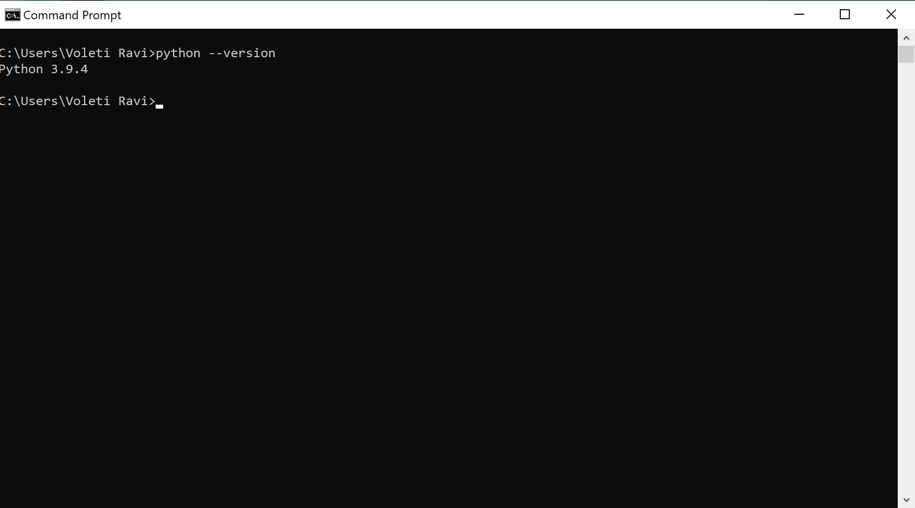

Prerequisite
--

<h3>Install python</h3>

Follow the guide to install python3 here:
https://www.python.org/downloads/

you can verify if python is installed correctly by running the following command.

```shell
python --version
```

It should look like this.

Mac:


Windows:


Ubuntu:


Execution
--
Set up:
   1. script 
   2. Cron Job

Script
--

Edit the following variables in the script: 

```python3
...
# Editable variables
profile_name = "<profile name>"
aws_access_key_id = "<access key>"
aws_secret_access_key = "<secret key>"
delete_after_retention_days = 0  # number of days must be a whole number.
bucket = "<bucket-name>"
prefix = "<prefix>"
endpoint = "https://s3.wasabisys.com"  # Endpoint of bucket
...
```

Cron Job
--

<h3>Windows</h3>

The easiest way to set up a cron job on Windows is by using the Windows Task scheduler.

Before we start creating the task schedule itself, we need to get some information to set up tasks.

First we need to create a batch file which will execute the python script every day:

1. create a file named `wasabi-scheduler.bat`
   To run the python script via the batch script we need to write the following in the file:
   ```shell
   "Path where your Python exe is stored\python.exe" "Path where your Python script is stored\script name.py"
   pause
   ```

2. In order to do that locate where the python.exe is located. An easy way is to Go to cmd and type:
   ```shell
    where python
   ``` 
   It should give you an output like this:
   

   Copy the location of the file and rewrite in the `wasabi-scheduler.bat` file. In my case it is:
   ```
   C:\Users\Voleti Ravi\AppData\Local\Programs\Python\Python39\python.exe
   ```


3. Next download and copy over the lifecycle script to a preferred location and get its path. An easy way to do that is
   by right click -> Location.

   

   Copy the location of the file and rewrite in the `wasabi-scheduler.bat` file similar to python location. In my case
   it is:
   ```
   C:\Users\Voleti Ravi\Desktop\lifecycle-current-non-current.py
   ``` 

4. Your batch file should look something like this.
   ```shell
   "C:\Users\Voleti Ravi\AppData\Local\Programs\Python\Python39\python.exe" "C:\Users\Voleti Ravi\Desktop\lifecycle-current-non-current.py"
   ```
   > The *pause* feature allows you to not immediately exit the program

   

Next Go to Start -> Task Scheduler and create a basic task from the right-hand side.


2. Create a name so that you may edit it later, if needed.


3. Create a daily backup.


4. Select a time for the task.


5. Select Start a program


6. Browse and select the wasabi-scheduler.bat file


8. Review your changes and press Finish.


You will find the task under Task schedule library. Here you can right click on the task and change any properties.


To test the application you can `right click -> press RUN` This script should run periodically every day.

Here I am running a dummy script to demonstrate this action.


To remove you can `right click -> delete` or select the task and press the delete option.

<h3>Mac</h3>
The best way to set up cron jobs on Mac is by using `crontab`

Crontab requires setting the time using a specific syntax. You can make use of this website https://crontab.guru/ to
create this syntax. Please read more about it
here: [Crontab quickstart reference](https://www.adminschoice.com/crontab-quick-reference).

1. you can set up the crontab by typing `crontab -e` in the terminal. This will open a vim console on the terminal:

   

2. press `i` to get into `[insert mode]` and paste the follow information:

   ```
   * * * * * osascript -e 'tell app "Terminal" to do script "python3 <absolute path of the python script>" activate'
   ```
   
   > NOTE:
   > 
   > Remember to replace the `* * * * *` with the correct time syntax.
   > 
   > Reason for: `osascript -e 'tell app "Terminal" to do script "python3 <absolute path of the python script>" activate`
   > Crontab runs tasks in the background without any visuals. Inorder to see an output You can use AppleScripts
   > combined with cron in order to emulate opening a Terminal and running the script from
   > within the Terminal.
   > 
   > if you wish to not do that you can simply run:
   > ```
   >* * * * * * /usr/bin/pyton3 <absolute path of the python script>
   > ```
   
   In our execution this is how it looks like:
   ```
   * * * * * osascript -e 'tell app "Terminal" to do script "python3 /Users/voletiravi/PycharmProjects/StorageCalculator/src/lifecycle/cron_test.py" activate'
   ```

3. Once you have done this, press ESC to exit Insert mode. Then type ":wq" to save your changes.

   

4. The script we just demonstrated will run the Cronjob every 1 minute.

   

5. To remove the cronjob. Type `crontab -e`, press `i` to go into `[insert mode]` remove the entry and press `escape` and
   `:wq` to quit.

<h3>Ubuntu</h3>

The best way to set up cron jobs on Ubuntu is by using `crontab`

Crontab requires setting the time using a specific syntax. You can make use of this website https://crontab.guru/ to
create this syntax. Please read more about it
here: [Crontab quickstart reference](https://www.adminschoice.com/crontab-quick-reference).

1. you can set up the crontab by typing `crontab -e` in the terminal. This will open a console on the terminal with your
   preferred editor, we are demonstrating this with nano:

   

2. scroll down to the bottom of the file and paste the follow information:

   ```
   * * * * * /usr/bin/python3 <absolute path of the python script>
   ```
   
   > NOTE:
   > 
   > Remember to replace the `* * * * *` with the correct time syntax.
   >
   
   In our execution this is how it looks like:
   ```
   * * * * * /usr/bin/python3 cron_test.py
   ```

3. Once you have done this press ^X to exit.

   

4. The script we just demonstrated will run the Cronjob every 1 minute. This particular script writes data to a text 
   file `t.txt`
   
   

   

5. To remove the cronjob. Type `crontab -e`, press `i` to go into `insert mode` remove the entry and press `escape` and
   `:wq` to quit.