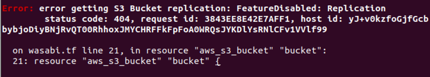

CONTENTS
--

>NOTE: This infrastructure automation example follows the exact model detailed in this KB document
>How to automate infrastructure design on Wasabi
>https://wasabi-support.zendesk.com/hc/en-us/articles/360057225472

More info on implementation details here: [How to automate infrastructure on Wasabi using Terraform?]()

INSTALLATION
--

## Install Terraform

Full Download guide here: https://learn.hashicorp.com/tutorials/terraform/install-cli

### UBUNTU

To use Terraform you will need to install it. HashiCorp distributes Terraform as a binary package. You can also install
Terraform using popular package managers.

HashiCorp officially maintains and signs packages for the following Linux distributions.

Add the HashiCorp GPG key.

```shell
$ curl -fsSL https://apt.releases.hashicorp.com/gpg | sudo apt-key add -
```

Add the official HashiCorp Linux repository.

```shell
$ sudo apt-add-repository "deb [arch=amd64] https://apt.releases.hashicorp.com $(lsb_release -cs) main"
```

Update and install.

```shell
$ sudo apt-get update && sudo apt-get install terraform
```

TIP: Now that you have added the HashiCorp repository, you can install Vault, Consul, Nomad and Packer with the same
command.

Verify that the installation worked by opening a new terminal session and listing Terraform's available subcommands.

```shell
terraform -help
```

> NOTE: Usage: terraform [-version] [-help] <command> [args]


The available commands for execution are listed below. The most common, useful commands are shown first, followed by
less common or more advanced commands. If you're just getting started with Terraform, stick with the common commands.
For the other commands, please read the help and docs before usage.

Add any subcommand to terraform -help to learn more about what it does and available options.

```shell
$ terraform -help plan
```

## Install MinIo

Full guide here: https://docs.min.io/docs/minio-quickstart-guide.html

### UBUNTU

Binary Download

Use the following command to run a standalone MinIO server on Linux hosts running 64-bit Intel/AMD architectures.
Replace /data with the path to the drive or directory in which you want MinIO to store data.

1. Download Minio Server and set executable permissions:

```shell
wget https://dl.min.io/server/minio/release/linux-amd64/minio
```

```shell
chmod +x minio
```

2. Configure the secret key and access key by exporting them:

```shell  
export MINIO_ROOT_USER=<access-key>
export MINIO_ROOT_PASSWORD=<secret-key>
```

Replace /data with the path to the drive or directory in which you want MinIO to store data.

The following table lists supported architectures. Replace the wget URL with the architecture for your Linux host.

|        Architecture         |                             URL                            | 
|           :---:             |                            :---:                           |
| 64-bit Intel/AMD            | https://dl.min.io/server/minio/release/linux-amd64/minio   |
| 64-bit ARM                  | https://dl.min.io/server/minio/release/linux-arm64/minio   |
| 64-bit PowerPC LE (ppc64le) | https://dl.min.io/server/minio/release/linux-ppc64le/minio |
| IBM Z-Series (S390X)        | https://dl.min.io/server/minio/release/linux-s390x/minio   |

The MinIO deployment starts using default root credentials minioadmin:minioadmin. You can test the deployment using the
MinIO Browser, an embedded web-based object browser built into MinIO Server. Point a web browser running on the host
machine to http://127.0.0.1:9000 and log in with the root credentials. You can use the Browser to create buckets, upload
objects, and browse the contents of the MinIO server.

You can also connect using any S3-compatible tool, such as the MinIO Client mc commandline tool. See Test using MinIO
Client mc for more information on using the mc commandline tool. For application developers,
see https://docs.min.io/docs/ and click MINIO SDKS in the navigation to view MinIO SDKs for supported languages.

> NOTE: Standalone MinIO servers are best suited for early development and evaluation. Certain features such as versioning, object locking, and bucket replication require distributed deploying MinIO with Erasure Coding. For extended development and production, deploy MinIO with Erasure Coding enabled - specifically, with a minimum of 4 drives per MinIO server. See MinIO Erasure Code Quickstart Guide for more complete documentation.


RUN
--

Once you have Installed Terraform and MinIo

1. Run the following shell script to start the Minio server and connect to your bucket on Wasabi as an s3 gateway using
   the service urls provided
   here: [What are the service URLs for Wasabi's different storage regions?](https://wasabi-support.zendesk.com/hc/en-us/articles/360015106031-What-are-the-service-URLs-for-Wasabi-s-different-storage-regions-?source=search)

    ```shell
    ./minio gateway s3 https://<service-url>
    ```

   In this example we are using the us-east-1 endpoint to demonstrate

    ```shell
    ./minio gateway s3 https://s3.wasabisys.com
    ```
   > NOTE: make sure that you have RUN the following before starting the gateway
   >
   > export MINIO_ROOT_USER=<access-key>
   >
   > export MINIO_ROOT_PASSWORD=<secret-key>

   This will run a MinIo Server at localhost:9000, enter your access-key and secret-key here if you wish to navigate
   your buckets on the Wasabi account.


2. Create a directory at a preferred location and create the .tf files needed, you can use the
   [main.tf](main.tf) [output.tf](output.tf) [variables.tf](variables.tf) [wasabi.tf](wasabi.tf)


2. Go to the location where the .tf scripts are present and run the following commands:
   ```shell
   terraform init
   ```
   ```shell
   terraform plan
   ```
   ```shell
   terrafrom apply
   ```

Errors
--

Using the aws service provider to create buckets currently throws an error like this:



> The reason for this error happens when using a different S3 implementation (here Wasabi) some features have been disabled due to not being completely implemented server side.

The Terraform folks have tried currently working on a fix where they apply a skip to replication_config. There is an
open issue being worked on here which is a similar case with AWS acceleration causing issues:
https://github.com/hashicorp/terraform-provider-aws/issues/14775

